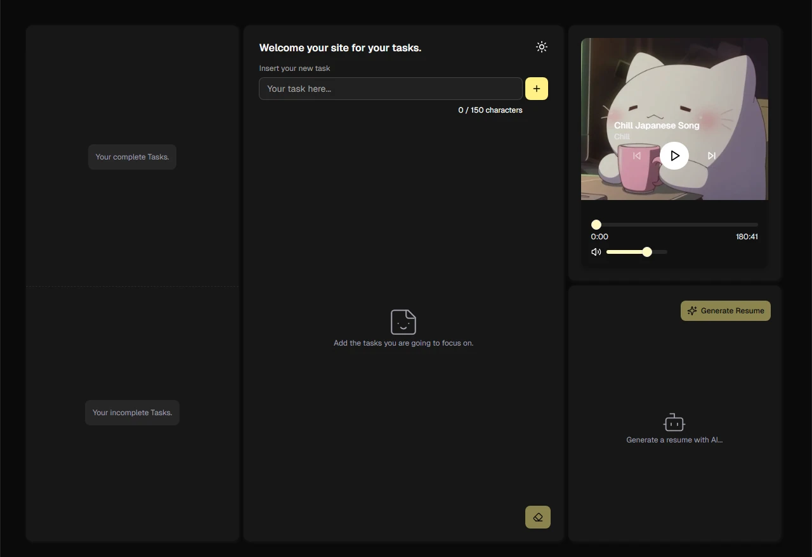

# TodoReact

Una aplicación moderna de tareas construida con React, TypeScript y Vite. Esta aplicación ayuda a los usuarios a gestionar sus tareas diarias con una interfaz limpia e intuitiva.



## Características

- Crear, leer, actualizar y eliminar tareas
- Interfaz de usuario moderna y responsiva
- Construido con TypeScript para mayor seguridad de tipos
- Experiencia de desarrollo rápida con Vite
- Soporte para temas claro y oscuro
- Componentes UI de alta calidad de shadcn/ui

## Tecnologías Utilizadas

- React 19
- TypeScript
- Vite
- Tailwind CSS para estilos
- shadcn/ui para componentes UI
- Zustand para estado global
- Sonner para notificaciones
- Lucide React para íconos

## Gestor de Paquetes

Este proyecto utiliza pnpm como gestor de paquetes. Asegúrate de tener pnpm instalado en tu sistema antes de comenzar.

## Dependencias Principales

- **UI y Componentes**:

  - shadcn/ui (Alert Dialog, Dialog, Label, Menubar, Slider, Slot, Tooltip)
  - Lucide React
  - Sonner
  - Tailwind CSS

- **Estado y Gestión**:

  - Zustand

## Dependencias de Desarrollo

- ESLint y plugins
- Jest para pruebas
- Vite con plugin React SWC
- Tipos de TypeScript

## Empezando

1. Clona el repositorio
2. Instala las dependencias usando pnpm:
   ```bash
   pnpm install
   ```
3. Inicia el servidor de desarrollo:
   ```bash
   pnpm dev
   ```
4. Abre tu navegador y navega a la URL mostrada en la terminal

## Desarrollo

Este proyecto utiliza:

- Vite para desarrollo rápido y construcción
- TypeScript para seguridad de tipos
- ESLint para calidad de código
- Jest para pruebas

## Scripts Disponibles

- `pnpm dev` - Iniciar servidor de desarrollo
- `pnpm build` - Construir para producción
- `pnpm lint` - Ejecutar ESLint
- `pnpm preview` - Previsualizar construcción de producción
